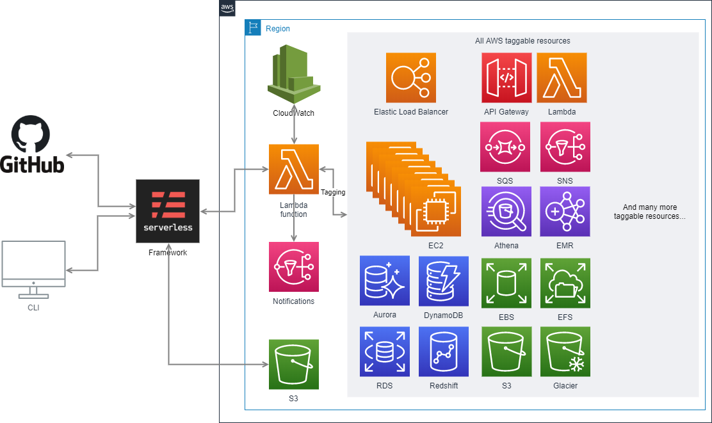

# aws-bulk-tagging
 A tool for tagging AWS resources massively.

## Goal
Apply a list of tags to a (large) set of AWS resources within an AWS region.

## Architecture

This module is fully serverless.
The architecture diagram is available [here](https://drive.google.com/file/d/1jkm8myPdMlQ0Kn7y97CIjkCmuJcnJhEn/view?usp=sharing).




## Use case
You want to add or update the following tags...
                    
| Key  | Value |
| ------------- | ------------- |
| Entity  | SALES  |
                    

...to all EC2 instances tagged with:
                    
| Key  | Value |
| ------------- | ------------- |
| Stage  | PROD  |
| App  | AWESOME_SALES_APP  |
                    

In this case, the request payload to the Lambda function will be:
```json
{
  "TagFilters": [
    {
      "Key": "Stage",
      "Values": [
        "PROD"
      ]
    },
    {
      "Key": "App",
      "Values": [
        "AWESOME_SALES_APP"
      ]
    }
  ],
  "TagsToApply": {
      "Entity": "SALES"
   },
  "ResourceTypeFilters": [
    "ec2:instance"
  ]
}
```

# How to use it?

## Solution 1: via GitHub
1. Create a fork of this current repository in your GitHub account
2. Go to the [Serverless Framework dashboard](https://dashboard.serverless.com/) and create:
- A profile
- An app
- A service (in the app), and link it to the fork repository

## Solution 2: via CLI
1. Install the Serverless Framework: https://serverless.com/
2. Configure your account and create at least one profile on your dashboard: https://dashboard.serverless.com/
3. Clone this repository
4. Uncomment this line in `serverless.yml` and replace `<YOUR_ORG>` with your Serverless Org:
   ```json
   # org: <YOUR_ORG>
   ```
5. Open a terminal on your local project directory:
`
$ sls deploy [--stage dev] [--region eu-west-1]
`

If you don't specify the `stage` and/or the `region`, il will use the values in the `custom` part of the `serverless.yml`:
 ```json
 custom:
    defaultRegion: eu-west-3
    defaultStage: dev
 ```

# List of taggable resources

- Alexa for Business (a4b)
- API Gateway
- Amazon AppStream
- AWS AppSync
- AWS App Mesh
- Amazon Athena
- Amazon Aurora
- AWS Backup
- AWS Certificate Manager
- AWS Certificate Manager Private CA
- Amazon Cloud Directory
- AWS CloudFormation
- Amazon CloudFront
- AWS CloudHSM
- AWS CloudTrail
- Amazon CloudWatch (alarms only)
- Amazon CloudWatch Events
- Amazon CloudWatch Logs
- AWS CodeBuild
- AWS CodeCommit
- AWS CodePipeline
- AWS CodeStar
- Amazon Cognito Identity
- Amazon Cognito User Pools
- Amazon Comprehend
- AWS Config
- AWS Data Pipeline
- AWS Database Migration Service
- AWS DataSync
- AWS Direct Connect
- AWS Directory Service
- Amazon DynamoDB
- Amazon EBS
- Amazon EC2
- Amazon ECR
- Amazon ECS
- AWS Elastic Beanstalk
- Amazon Elastic File System
- Elastic Load Balancing
- Amazon ElastiCache
- Amazon Elasticsearch Service
- AWS Elemental MediaLive
- AWS Elemental MediaPackage
- AWS Elemental MediaTailor
- Amazon EMR
- Amazon FSx
- Amazon S3 Glacier
- AWS Glue
- Amazon GuardDuty
- Amazon Inspector
- AWS IoT Analytics
- AWS IoT Core
- AWS IoT Device Defender
- AWS IoT Device Management
- AWS IoT Events
- AWS IoT Greengrass
- AWS Key Management Service
- Amazon Kinesis
- Amazon Kinesis Data Analytics
- Amazon Kinesis Data Firehose
- AWS Lambda
- AWS License Manager
- Amazon Machine Learning
- Amazon MQ
- Amazon MSK
- Amazon Neptune
- AWS OpsWorks
- AWS Organizations
- Amazon Quantum Ledger Database (QLDB)
- Amazon RDS
- Amazon Redshift
- AWS Resource Access Manager
- AWS Resource Groups
- AWS RoboMaker
- Amazon Route 53
- Amazon Route 53 Resolver
- Amazon S3 (buckets only)
- Amazon SageMaker
- AWS Secrets Manager
- AWS Security Hub
- AWS Service Catalog
- Amazon Simple Notification Service (SNS)
- Amazon Simple Queue Service (SQS)
- AWS Step Functions
- AWS Storage Gateway
- AWS Systems Manager
- AWS Transfer for SFTP
- Amazon VPC
- Amazon WorkSpaces